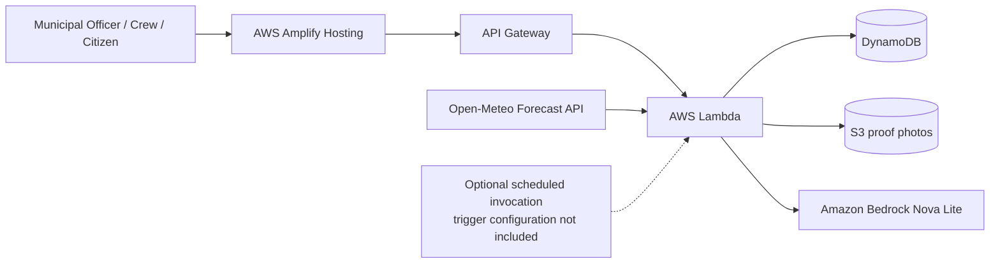

# NalaSetu

<p align="center">
  <a href="https://main.d2ui5wwbz0rjfy.amplifyapp.com"></a>
  <a href="https://github.com/sujalgiriiitp-source/NalaSetu"></a>
  
  
  
</p>

NalaSetu is a municipal operations prototype that helps teams decide which drains to clean before heavy rainfall. It combines rainfall forecasts, historical blockage records, terrain, citizen reports, explainable risk scoring, task dispatch, field evidence, and review workflows in a single civic-tech dashboard.

This repository is a working demo and prototype: it is designed for operational planning and story-driven evaluation, not as a certified municipal monitoring system. On 2026-10-09 UTC, a reachability check observed the configured frontend URL redirect to `/login` and return HTTP 200, and the configured API `/api` endpoint return HTTP 200. These response checks do not verify complete user workflows, data persistence, or individual integrations.

## Table of contents

- [Project overview](#project-overview)
- [Why this problem matters](#why-this-problem-matters)
- [End-to-end workflow](#end-to-end-workflow)
- [What is implemented](#what-is-implemented)
- [Risk scoring in code](#risk-scoring-in-code)
- [Cleaning plan and crew dispatch](#cleaning-plan-and-crew-dispatch)
- [Photo verification and AI review](#photo-verification-and-ai-review)
- [Architecture](#architecture)
- [Technology stack](#technology-stack)
- [Project structure](#project-structure)
- [Installation and local development](#installation-and-local-development)
- [Environment variables](#environment-variables)
- [API documentation](#api-documentation)
- [AWS deployment notes](#aws-deployment-notes)
- [Security, limitations, and demo data](#security-limitations-and-demo-data)
- [Roadmap](#roadmap)
- [Testing and quality](#testing-and-quality)
- [Contribution, license, and credits](#contribution-license-and-credits)

## Project overview

NalaSetu is meant for a simple operational question: before a rain event, which drains should be cleaned first?

The project models a municipal workflow:

1. Pull rainfall forecast data.
2. Assess each drain using historical choke records, slope/terrain, and recent citizen signals.
3. Score and rank drains by explainable risk.
4. Generate a crew plan that respects available hours and travel costs.
5. Dispatch cleaning tasks.
6. Collect before/after photos.
7. Run verification logic and route uncertain results to manual review.

The repository is intentionally focused on a prototype workflow rather than a fully productionized city platform. The code clearly marks demo data, projected impact estimates, and review gates.

## Why this problem matters

Drain blockages can contribute to urban waterlogging. Municipal teams usually have limited workers, time, and cleaning capacity. If crews react only after complaints or flooding, the response can be too late. A preventive workflow can help by using rainfall forecasts and historical blockage patterns to prioritize cleaning before rainfall arrives.

Citizen reports provide an extra signal about local conditions, but they should not be treated as the only source of truth. NalaSetu combines several signals into a transparent score and recommends a priority band:

- HIGH
- MEDIUM
- LOW

The score is intended to support municipal decision-making; it does not replace direct inspection, engineering judgment, or official operations policy.

## End-to-end workflow

The code implements a clear prototype workflow:

1. Load forecast data from the app server route at `/api/weather` using Open-Meteo, with cached and demo fallback behavior.
2. Collect drain characteristics such as slope, low-lying status, historical choke count, citizen reports, and cleaning duration.
3. Recompute risk scores through the Lambda API or frontend logic.
4. Assign a risk band, display drains on a geographic map, and show an explainable breakdown.
5. Generate a crew dispatch plan based on crew availability and estimated travel/cleaning time.
6. Dispatch tasks to teams.
7. Track task states through the implemented status workflow.
8. Submit before/after evidence for a clean-up job.
9. Run verification using either demo logic or the Amazon Bedrock path when configured.
10. Route low-confidence or uncertain results to `REVIEW` / `NEEDS_REVIEW` rather than auto-approving.
11. Allow an authorized officer or prototype officer workflow to approve or reject the proof.
12. Display operational progress and projected impact estimates, clearly labelled as estimates.

The actual status names in the code are:

- `UNASSIGNED`
- `ASSIGNED`
- `EN_ROUTE`
- `CLEANING`
- `PROOF_SUBMITTED`
- `VERIFIED`
- `NEEDS_REVIEW`
- `REJECTED`

## What is implemented

The repository contains a front-end application and a Lambda backend that together form a demonstration system.

### Features present in the code

- Municipal operations dashboard and risk overview
- Geographic risk map with drain markers and detail sheet
- Drain detail views with risk explanations and forecast context
- Rainfall and weather source toggle, including cached/live/demo modes
- Cleaning-plan generation using crew availability and travel estimates
- Crew dispatch and task tracking
- Before/after photo submission for proof of work
- Verification workflow with demo and Bedrock-backed checks
- Officer review and approval path
- Citizen report input flow
- Projected impact metrics, clearly labelled as estimated
- Synthetic demo data mode that works without live AWS credentials

### Demo and prototype boundaries

Several of these features are clearly framed as demo or synthetic in code and UI:

- Demo drains are generated in `src/lib/nalasetu/data.ts` and `lambda/index.mjs`.
- Weather can run in `demo`, `cached`, and `live` modes.
- Impact numbers are labelled as projected or estimated.
- Proof verification can fail safely to `REVIEW` when confidence is low or evidence is weak.

## Risk scoring in code

The repository implements the following formula exactly in both the frontend and Lambda backend:

`Score = 0.40 × R + 0.25 × H + 0.20 × S + 0.15 × C`

Where:

- `R = min(100, forecastMm72 / 60 × 100)`
- `H = min(100, historicalChokes / 5 × 100)`
- `S = Low: 100, Medium: 55, High: 20`
- `C = min(100, citizenReports / 6 × 100)`

This is implemented in `src/lib/nalasetu/risk.ts` and mirrored in `lambda/index.mjs`.

### Risk bands

| Band | Condition |
|---|---|
| HIGH | score >= 70 |
| MEDIUM | score >= 40 |
| LOW | score < 40 |

### Why this score is explainable

The score is transparent because each component corresponds to a visible operational factor:

- rainfall forecast risk
- blockage history
- terrain risk
- citizen reports

The code exposes the component contributions and supporting reasons in the UI, which makes scoring auditable and easier for an officer to understand than a black-box model alone.

### Important note

This is a prototype operational score. It helps prioritize work but does not claim to be a scientifically validated flood-prediction model or a replacement for field inspection.

## Cleaning plan and crew dispatch

The dispatch logic is implemented in `src/lib/nalasetu/dispatch.ts` and mirrored by Lambda helper functions in `lambda/index.mjs`.

The algorithm is pragmatic rather than globally optimal:

- It filters candidate drains to `HIGH` and `MEDIUM` risk items that are still unassigned.
- It groups drains into approximately 1.1 km grid cells to preserve geographic locality.
- It greedily ranks assignments by `risk score / (cleaning time + estimated travel time)`, with a large HIGH-risk priority bonus and a same-cell locality bonus.
- It assigns tasks while never exceeding each crew's available hours.
- It routes each crew using nearest-neighbour ordering from the crew base.
- It calculates total cleaning time, travel time, distance, and high-risk coverage.

The code comments explicitly describe the logic as a greedy planning heuristic designed to maximize high-risk coverage while respecting limited crew-hours and reducing unnecessary travel. The project does not claim perfect optimality.

### Values in the prototype

Travel uses straight-line Haversine distance multiplied by a road factor of `1.3` and an assumed average speed of `15 km/h`:

These are prototype assumptions for estimating time and distance, not live routing telemetry.

## Photo verification and AI review

This part of the repository is especially important and should be read carefully.

The Lambda implementation in `lambda/index.mjs` imports:

- `@aws-sdk/client-bedrock-runtime`
- `BedrockRuntimeClient`
- `ConverseCommand`

The code reads `BEDROCK_MODEL_ID` from the Lambda environment. The code has no model-ID default; `.env.example` gives this example value:

`amazon.nova-lite-v1:0`

The verification logic:

- accepts before/after image data for a proof submission
- optionally stores photos in S3 and can later retrieve S3 object keys
- calls Bedrock with a multimodal prompt containing both images
- asks the model for JSON containing `verdict`, `confidence`, `reason`, `sameLocation`, `obstructionBefore`, and `obstructionAfter`; the response is extracted with a regular expression and parsed with `JSON.parse`
- forces `REVIEW` when confidence is below 70, `sameLocation` is false, or `obstructionAfter` is true
- uses deterministic demo verification when the model is not configured; missing or oversized data and Bedrock failures route to `REVIEW` in fallback mode

### Verified behavior in code

The implemented gates are:

- if `BEDROCK_MODEL_ID` is absent: fallback to `demo`
- if data is missing: `REVIEW`, `confidence: 0`
- if either image exceeds 5 MB: `REVIEW` in fallback mode
- if the Bedrock request or response parsing fails: `REVIEW` in fallback mode
- if confidence is below 70, `sameLocation` is false, or `obstructionAfter` is true: force `REVIEW`
- otherwise the model's `PASS` verdict may pass these code gates; this is not an independent computer-vision validation of improvement

### Human review remains required

This is not presented as definitive proof that a drain has been cleaned. The code explicitly routes ambiguous, low-confidence, or failed results to review and the object model includes officer approval/rejection logic (`APPROVED` or `REJECTED`).

The project has:

- demo verification logic (`mode: "demo"`)
- Bedrock-backed verification (`mode: "bedrock"`)
- fallback review (`mode: "fallback"`)

The verification feature is implemented in code and is designed to be safety-first, not fully autonomous.
The Bedrock integration is implemented in code but requires AWS credentials, model access, permissions, and runtime verification before it can be considered operational.

## Architecture

The repository contains an Amplify frontend build configuration and Lambda handler code. The diagram below shows an intended integration, not a complete infrastructure deployment; infrastructure-as-code is not included.



### Service status by evidence

The repository contains code or configuration for these integration points:

- Amplify build and hosting output settings via `amplify.yml`
- a Lambda handler in `lambda/index.mjs`, with DynamoDB access
- optional S3 photo and Bedrock model invocation paths in the Lambda
- an Open-Meteo weather fetch in `src/routes/api/weather.ts`
- a frontend API base URL setting in `.env.example`

These do not establish that cloud resources are currently deployed or operational. In particular:

- The Lambda recognizes scheduled-event input, but no EventBridge schedule or trigger configuration is included.
- Authentication uses client-side demo roles. It does not securely protect API routes; Cognito is an architectural swap-in point, not a configured provider.

## Technology stack

| Technology | Purpose | Implementation status |
|---|---|---|
| React | Front-end UI | Implemented |
| TypeScript | App and Lambda logic | Implemented |
| TanStack Start | App framework and routing | Implemented |
| Tailwind CSS | Styling | Implemented |
| Leaflet via `LazyMap` | Map rendering | Implemented in front-end |
| AWS Amplify Hosting | Front-end hosting | Configured via `amplify.yml` |
| Amazon API Gateway | Frontend API base URL target | URL is set in `.env.example`; deployed API and reachability are not established by repository configuration |
| AWS Lambda | Backend API and verification logic | Implemented in `lambda/index.mjs` |
| DynamoDB | Drain/task/plan/proof storage | Implemented in Lambda code |
| Amazon S3 | Proof photo storage | Implemented in Lambda code |
| Amazon Bedrock | AI verification | Implemented in Lambda code; runtime verification required |
| Open-Meteo | Weather forecast source | Implemented in app route |
| Vitest | Test runner | Configured in `vitest.config.ts` and package scripts |

## Project structure

```text
.
├── .env.example              # Safe environment variable reference
├── .gitignore                # Repository ignore rules
├── amplify.yml               # AWS Amplify build configuration
├── bun.lock                  # Bun lockfile present in the repo
├── components.json           # shadcn-style component config
├── eslint.config.js          # ESLint configuration
├── lambda/
│   ├── index.mjs             # AWS Lambda router and verification logic
│   └── package.json          # Lambda dependencies
├── package.json              # Front-end scripts and dependencies
├── public/                   # Static assets
├── README.md                 # Project documentation
├── roadmap.md                # Project roadmap artifact
├── src/
│   ├── components/           # UI components
│   ├── lib/nalasetu/         # Risk, dispatch, state, auth, and verification logic
│   ├── routes/               # TanStack routes; includes /dashboard, /map, /tasks, /settings
│   ├── styles.css            # Tailwind-powered styling
│   ├── test/                 # Test files
│   └── ...                   # App and router setup
├── tsconfig.json             # TypeScript configuration
├── vite.config.ts            # Vite config
├── vitest.config.ts          # Vitest config
```

## Installation and local development

### Prerequisites

- Node.js and npm compatible with the versions in `package.json`
- npm
- A terminal with Git access
- Optional: AWS credentials and Lambda/DynamoDB/S3 access if you want to exercise the backend path

### 1. Clone the repository

```bash
git clone https://github.com/sujalgiriiitp-source/NalaSetu.git
cd NalaSetu
```

### 2. Install dependencies

```bash
npm install
```

The repository includes `bun.lock`, but its Amplify build uses `npm ci`.

### 3. Configure environment variables

Copy the example file and review values:

```bash
cp .env.example .env
```

Then edit `.env` to align with your environment. The frontend reads `VITE_NALASETU_API_URL` at build time. Set backend-only values in the Lambda environment, not in browser-exposed variables. `LOVABLE_API_KEY`, if used, is server-side only and must never use a `VITE_` prefix.

### 4. Run the app locally

```bash
npm run dev
```

This starts the TanStack Start development server and exposes the app locally.

### 5. Build the production bundle

```bash
npm run build
```

Available lint, test, development-build, and preview scripts

```bash
npm run lint
npm run test
npm run test:watch
npm run build:dev
npm run preview
```

These scripts are defined in the root `package.json`. Amplify runs `npm ci`, then `env NITRO_PRESET=aws-amplify npm run build`, and publishes `.amplify-hosting`.

## Environment variables

The repository has a real `.env.example` file. It contains the following values:

| Variable | Purpose | Required? | Example / safe default |
|---|---|---:|---|
| `VITE_NALASETU_API_URL` | Frontend base URL for Lambda API requests | Configure for API-connected UI | `https://o39m3kgdyb.execute-api.us-east-1.amazonaws.com` |
| `S3_BUCKET` | Lambda bucket name for optional proof-photo storage | Optional; backend-only | `<your-private-bucket-name>` |
| `BEDROCK_MODEL_ID` | Lambda model ID for multimodal verification | Optional; omitted to use demo verification | `amazon.nova-lite-v1:0` (example only; no code default) |
| `LOVABLE_API_KEY` | Optional key for the server-side AI route | Optional; server-only, commented out in `.env.example` | `your-key-here` |
| `AWS_REGION` | AWS SDK region used by the Lambda | Lambda default: `us-east-1` | Not in `.env.example` |
| `DYNAMODB_TABLE` | DynamoDB table used by the Lambda | Lambda default: `NalaSetu` | Not in `.env.example` |
| `NALASETU_API_URL` | Optional server-side API URL | Optional; server-only | Not in `.env.example` |

Important notes:

- Do not place AWS secret access keys in frontend environment variables.
- AWS workloads should use least-privilege IAM roles and runtime credentials where possible.
- Do not expose server-side variables using a `VITE_` prefix.
- The frontend includes synthetic demo data. This does not imply backend persistence works without a configured Lambda/API and AWS resources.

## API documentation

The Lambda handler in `lambda/index.mjs` routes JSON HTTP requests under `/api`. This table describes the handler contract, not a guarantee that every route is deployed at the configured API URL.

### AWS Lambda / API Gateway endpoints

| Method | Path | Purpose |
|---|---|---|
| `GET` | `/api/drains` | List drain records and enrich them with live or demo forecast context |
| `GET` | `/api/drains/{id}` | Fetch one drain by ID |
| `POST` | `/api/drains/seed` | Seed provided `drains` or built-in demo drains; also clears existing task, proof, and plan records |
| `POST` | `/api/risk/recompute` | Recompute risk scores and risk-band counts |
| `POST` | `/api/plans/generate` | Create a cleaning plan for crews |
| `POST` | `/api/plans/{id}/dispatch` | Dispatch a plan and create tasks |
| `PATCH` | `/api/tasks/{id}` | Update a task status |
| `POST` | `/api/tasks/{id}/proof` | Submit before/after image data and trigger verification |
| `POST` | `/api/proofs/{id}/verify` | Re-run verification for a proof |
| `POST` | `/api/proofs/{id}/review` | Record an officer approve/reject decision |
| `GET` | `/api/impact` | Return projected impact estimates |
| `GET` | `/api/settings` | Read settings |
| `PATCH` | `/api/settings` | Update scenario or weather mode |
| `GET` | `/api` or `/` | Health/status probe |
| `POST` | `/api/verify` | Test-lab standalone verification without a task |

### Request and response shapes

Representative handler contracts (omitted fields may be present in returned records):

| Endpoint | Request JSON | Response shape |
|---|---|---|
| `GET /api/drains` | — | `{ drains: Drain[], total: number, source: string }` |
| `GET /api/drains/{id}` | — | Enriched `Drain` record |
| `POST /api/drains/seed` | Optional `{ drains: Drain[] }` | `{ seeded: number, message: string }` |
| `POST /api/risk/recompute` | Optional `{ forecastMm72h?: number }` | `{ updated: number, counts: { HIGH: number, MEDIUM: number, LOW: number }, forecastMm72?: number, message?: string }` |
| `POST /api/plans/generate` | Optional `{ scenario?: string, forecastMm72h?: number }` | `{ plan: Plan }` |
| `POST /api/plans/{id}/dispatch` | Empty body | `{ tasks: Task[], dispatched: boolean }` |
| `PATCH /api/tasks/{id}` | `{ status: TaskStatus }` | Updated `Task` record |
| `POST /api/tasks/{id}/proof` | `{ before: ImageData, after: ImageData }` | `{ proof: Proof, verification: Verification, taskId: string }` |
| `POST /api/proofs/{id}/verify` | Empty body | `{ proof: Proof, verification: Verification }` |
| `POST /api/proofs/{id}/review` | `{ decision: "APPROVED" \| "REJECTED", officerName?: string }` | `{ proof: Proof, decision: string }` |
| `GET /api/impact` | — | Impact stats object returned directly, including `completed`, `total`, `highCoveragePct`, `highDone`, and `exposurePct` |
| `GET /api/settings` | — | Settings record, including `scenario` and `weatherMode` |
| `PATCH /api/settings` | `{ scenario?: string, weatherMode?: string }` | Updated settings record |
| `GET /api` or `/` | — | Health/status object with service, table, and region fields |
| `POST /api/verify` | `{ before: ImageData, after: ImageData, drainId?: string }` | `{ verification: Verification }` |

`ImageData` is a before/after image data URI. `TaskStatus`, `Drain`, `Plan`, `Task`, `Proof`, and `Verification` denote the corresponding application record or supported status values; response records can contain additional fields.

`POST /api/drains/seed` is destructive to existing task, proof, and plan records in the configured table; use it only when resetting demo state is intended. Missing required fields and invalid task transitions return HTTP 400; missing records return HTTP 404; unexpected handler exceptions return HTTP 500. Responses use JSON.

S3 uploads are optional. When configured, the handler attempts to upload proof images; on upload errors it logs the failure and continues with metadata only. Each image is limited to 5 MB for the Bedrock verification path.

### Weather route

The app server includes a separate route at `/api/weather` for Open-Meteo data at latitude `28.63`, longitude `77.22`, with hourly forecast data for 72 hours:

- `GET /api/weather`
- Returns `forecastMm72h`, `hourly`, `fetchedAt`, and `source`
- Source values: `live`, `cached`, or `demo`
- If Open-Meteo fails, the route falls back to cached or built-in demo data

## AWS deployment notes

The repository configures the Amplify frontend build in `amplify.yml`. It does not include a complete backend deployment or infrastructure-as-code package.

### Deployment flow in this repo

- Frontend build runs `npm ci` and `env NITRO_PRESET=aws-amplify npm run build`
- Output is published from `.amplify-hosting`
- Lambda handler code is in `lambda/index.mjs`, but this repository provides no Lambda deployment command or provisioning configuration
- The app reads its API base URL from `VITE_NALASETU_API_URL`

### Explicitly configured AWS resources in code

- Amplify build/hosting configuration
- Lambda handler logic, including DynamoDB access
- Optional S3 and Bedrock integration code
- Open-Meteo weather route in the app server

### Not verified as production infrastructure here

The README intentionally avoids claiming that the full AWS environment is reproducible from a single command. The repository has no infrastructure-as-code or deployment evidence for the API Gateway, Lambda, DynamoDB table, S3 bucket, Bedrock permissions, or scheduled trigger. The frontend and API URL response checks observed HTTP 200 on 2026-10-09 UTC (the frontend redirects to `/login`); those checks do not validate full user journeys, persistence, or every integration.

Users should review IAM, resource naming, bucket policies, and service pricing before running a live pilot.

## Security, limitations, and demo data

### Demo dataset

`Demo Dataset — synthetic prototype data, not real municipal data.`

All generated drain records, rainfall scenarios, crew plans, impact estimates, and risk examples are synthetic prototype data. They may be estimated or projected and should not be treated as operational facts.

### Security and safe practices

- Never commit `.env` files or real AWS credentials.
- Keep `.env.example` to safe placeholders only.
- Use least-privilege IAM for Lambda, S3, and Bedrock access.
- Validate photo uploads and request payloads.
- Treat S3 photo storage as restricted access; keep it private.
- Do not rely on browser-side role selection as a secure authorization mechanism.
- Real municipal deployment should add stronger server-side authorization, audit logging, and operational controls.
- Do not expose citizen-report personal data in plain text.

### Current auth status

The repository includes a demo auth adapter in `src/lib/nalasetu/auth.tsx`; roles are stored and enforced client-side. This is not secure API authorization or a production identity provider. Cognito is an architectural swap-in point, not a configured provider.

This means the app is good for prototype evaluation but not ready for production municipal access control.

## Roadmap

The project currently looks like a prototype for civic operations planning. Likely next steps include:

- production authentication and role-based authorization
- live municipal GIS and drain inventory integration
- more robust field-data collection and photo capture workflows
- better model validation and human-in-the-loop review workflows
- improved weather refresh and error handling
- operational notifications for crews and officers
- infrastructure-as-code for AWS deployment
- field pilots and measured outcome validation
- accessibility and mobile usability improvements
- more automated tests and edge-case coverage

## Testing and quality

The project includes a Vitest configuration and test files under `src/test/`.

The README commands are:

```bash
npm run lint
npm test
```

No code path here required a project-wide test run for the README-only change. The task validated link targets and repository evidence directly instead of claiming a passing suite.

## Contribution, license, and credits

### Contributing

Contributions are welcome, but the repository should be treated as a prototype project with evolving operational assumptions.

A sensible contribution flow is:

```bash
git checkout -b feature/your-change
npm install
npm run dev
npm test
```

### License

There is no verified `LICENSE` file in the repository at the current state. That means reuse permissions should not be assumed. If this project is later licensed, the repository should add the official license file and update this section.

### Credits and attributions

- Open-Meteo provides weather data for the live forecast route.
- OpenStreetMap is used through the map stack for geographic context and should retain attribution as required by map-provider terms.
- The project uses Amazon AWS services for hosting, API, storage, and AI verification in the configured prototype architecture.

## High-confidence summary

NalaSetu is a prototype civic operations dashboard for drain-risk prioritization and crew dispatch. It is strongest as a decision-support tool for a municipal operations team planning pre-rain maintenance, not as an autonomous flood-prevention engine.

The repository implements the core workflow in code and documents the important safety boundaries: synthetic demo data, estimated impact, human review, and careful AI risk handling.

## Configured URLs and reachability

- Frontend URL: https://main.d2ui5wwbz0rjfy.amplifyapp.com
- GitHub: https://github.com/sujalgiriiitp-source/NalaSetu
- Backend API base URL in `.env.example`: https://o39m3kgdyb.execute-api.us-east-1.amazonaws.com

On 2026-10-09 UTC, the frontend URL redirected to `/login` and returned HTTP 200; the API `/api` returned HTTP 200. These are reachability checks only, not end-to-end verification of workflows or integrations.

## Notes on verification

This README reflects repository evidence from the actual code:

- frontend routes and app behavior in `src/`
- Lambda router and verification logic in `lambda/index.mjs`
- environment and AWS config in `.env.example` and `amplify.yml`
- package and dependency config in `package.json` and `lambda/package.json`
- risk and dispatch logic in `src/lib/nalasetu/`

If a feature is not fully runtime-tested, it is identified as such in the README rather than described as complete production capability.
