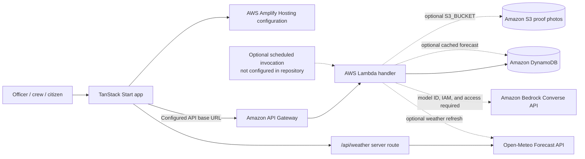

# NalaSetu

<p align="center">
  <strong>Decide which drains to clean first—before heavy rainfall.</strong><br />
  A civic-operations prototype for risk-informed drain maintenance, crew dispatch, and accountable field review.
</p>

<p align="center">
  <a href="https://main.d2ui5wwbz0rjfy.amplifyapp.com"></a>
  <a href="https://github.com/sujalgiriitp-source/NalaSetu"></a>
  
  
  
</p>

> **Prototype notice:** The demo and its dataset are for evaluation and development, not operational municipal use. The supplied demo URL and API base URL are configured links; neither was runtime-checked while preparing this README.

NalaSetu brings rainfall context, drain history, terrain, citizen-reported issues, and crew capacity into one explainable maintenance workflow. Teams can compare drain priorities, generate an estimated cleaning plan, track task states, submit before/after evidence, and record an officer's review. Its scores support—not replace—field inspection and official judgment.

**Demo dataset:** synthetic prototype data, not real municipal data. The sample locations, rainfall scenarios, crews, reports, risk scores, and impact figures may be simulated or estimated; the project does not claim to prevent every flood or guarantee reduced waterlogging.

## Table of contents

- [The problem and approach](#the-problem-and-approach)
- [Workflow and features](#workflow-and-features)
- [Risk scoring](#risk-scoring)
- [Cleaning plan and crew dispatch](#cleaning-plan-and-crew-dispatch)
- [Photo verification and review](#photo-verification-and-review)
- [Architecture and technology](#architecture-and-technology)
- [Project structure](#project-structure)
- [Run locally](#run-locally)
- [Configuration](#configuration)
- [API reference](#api-reference)
- [AWS deployment](#aws-deployment)
- [Security, limitations, and data](#security-limitations-and-data)
- [Roadmap](#roadmap)
- [Testing](#testing)
- [Contributing, license, and credits](#contributing-license-and-credits)

## The problem and approach

Drain blockages can contribute to urban waterlogging, while municipal teams have limited workers, time, and cleaning capacity. Reactive cleaning after a complaint may not leave enough time before a rain event. Forecasts, blockage history, terrain characteristics, and local reports can help teams prioritize preventive maintenance—but only if officers can understand why a location is flagged and track what happens next.

NalaSetu combines those signals into visible risk factors and HIGH, MEDIUM, or LOW bands, then estimates a crew plan within sample capacity limits. The workflow links the recommendation to assignment, task progress, evidence, and review. Scores are decision support, not a scientifically validated flood prediction, engineering assessment, or substitute for on-ground inspection.

## Workflow and features

1. The app obtains a 72-hour Open-Meteo rainfall forecast from its `/api/weather` server route, or clearly labelled cached/demo data.
2. It combines available drain attributes—historical chokes, terrain/slope, per-drain rainfall exposure, and citizen-report counts.
3. It calculates a rounded risk score and shows component reasons and a risk band.
4. Officers can view drains on a Leaflet map, inspect details, generate a crew plan, adjust assignments, and dispatch work.
5. Crews progress tasks through the implemented status flow and can submit before/after photo evidence.
6. Configured verification paths return a verdict for review; an officer can approve or reject evidence. A model `PASS` is not itself the task's final human verification.
7. The dashboard reports operational counts and projected exposure/coverage indicators, not measured flood reduction.

| Capability | What is in the repository | Boundary |
|---|---|---|
| Operations dashboard, drain list/map, details, risk explanations | Implemented in the TanStack Start UI; Leaflet loads through `LazyMap` | Uses sample drain inventory unless connected data is supplied |
| Rainfall information | `/api/weather` fetches Open-Meteo and returns `live`, `cached`, or `demo` source labels | Demo fallback is a scenario value, not a forecast |
| Citizen reports | Report form and local state update the selected demo drain's report count | Reports are stored in browser demo state; the Lambda router has no citizen-report endpoint |
| Cleaning plan, dispatch, task tracking | Local planning and status workflow; matching planning and task routes in Lambda | Sample crews/capacities and straight-line travel estimates |
| Before/after evidence and verification | Photo workflow, deterministic demo verifier, server-side AI route, and Lambda Bedrock code | Provider availability depends on runtime configuration; human review remains necessary |
| Officer review | UI and Lambda proof-review path can record approval or rejection | Current role selection is client-side demo authorization, not secure identity |
| Impact view | Completion, HIGH-risk coverage, population-weighted exposure estimate, and crew minutes | Explicitly projected/estimated; not measured real-world outcomes |

The task statuses in `src/lib/nalasetu/state-machine.ts` are `UNASSIGNED`, `ASSIGNED`, `EN_ROUTE`, `CLEANING`, `PROOF_SUBMITTED`, `VERIFIED`, `NEEDS_REVIEW`, and `REJECTED`. Valid transitions are enforced through `transition()` in the client workflow and checked in the Lambda task-status route. The proof record has its own verification/review statuses; these are not additional task statuses.

## Risk scoring

The frontend implementation in [`src/lib/nalasetu/risk.ts`](src/lib/nalasetu/risk.ts) and the Lambda implementation use the same weighted model. The code normalizes each input, computes a weighted sum, rounds it to an integer, then assigns a band.

| Factor | Normalized value | Weight |
|---|---|---:|
| Rainfall risk (`R`) | `min(100, forecastMm72 / 60 × 100)` | 40% |
| Historical blockage (`H`) | `min(100, historicalChokes / 5 × 100)` | 25% |
| Terrain (`S`) | Low slope: 100; Medium: 55; High: 20 | 20% |
| Citizen reports (`C`) | `min(100, reportsLast30d / 6 × 100)` | 15% |

`Score = 0.40 × R + 0.25 × H + 0.20 × S + 0.15 × C` (rounded to the nearest integer).

| Priority | Score |
|---|---:|
| HIGH | 70–100 |
| MEDIUM | 40–69 |
| LOW | 0–39 |

For the demo, rainfall risk is based on the per-drain 72-hour rainfall value after scaling it to the selected scenario/forecast; report counts are described in code as the last 30 days. The component contributions and plain-language reasons make the score inspectable. No single factor—including citizen reports—determines the result. The score and thresholds are prototype rules; field validation is needed before operational use.

## Cleaning plan and crew dispatch

[`src/lib/nalasetu/dispatch.ts`](src/lib/nalasetu/dispatch.ts) implements a practical heuristic, not a globally optimal route or a proven optimal knapsack solver:

- Considers only unassigned HIGH- and MEDIUM-risk drains.
- Uses sample crew capacities and cleaning durations; demo crews have 6, 5, and 4 available hours.
- Greedily selects work by a risk-score-to-cleaning-plus-estimated-travel cost ratio, gives HIGH risk a priority bonus, and gives a locality bonus to adjacent work in the same approximate 0.01-degree grid cell.
- Orders each crew's stops with a nearest-neighbour heuristic from its home base.
- Reports estimated distance, travel/cleaning time, planned hours, and the share of HIGH-risk drains covered by the plan.

Travel estimates use Haversine distance, a 1.3 road-distance factor, and an assumed average speed of 15 km/h. These are planning assumptions, not road-network routing or live traffic. Crew data and availability are sample values, not an external roster.

## Photo verification and review

There are multiple verification paths; their output must not be treated as definitive proof that work was completed:

- **Demo:** `src/lib/nalasetu/verify.ts` contains deterministic simulated verification. It checks whether evidence is missing or identical, then derives a demo verdict from image-string characteristics. It does not visually inspect the drain.
- **Lambda / Bedrock:** `lambda/index.mjs` imports `BedrockRuntimeClient` and `ConverseCommand` from `@aws-sdk/client-bedrock-runtime`, reads `BEDROCK_MODEL_ID`, and sends before/after image bytes to the model. `amazon.nova-lite-v1:0` is the example model ID in `.env.example`, not a code default. Lambda can fetch `proofs/...` S3 object keys during re-verification.
- **TanStack server function / Lovable AI:** `src/lib/nalasetu/ai-verify.server.ts` uses the Lovable AI Gateway when `LOVABLE_API_KEY` is available; `ai-verify.functions.ts` tries the configured AWS API first, then the Lovable AI path.

The Lambda verification result includes `verdict` (`PASS` or `REVIEW`), `confidence`, `reason`, and `mode` (`bedrock`, `demo`, or `fallback`); Bedrock results also include location/obstruction flags. Low confidence (below 70), location mismatch, visible remaining obstruction, missing evidence, unsupported image input, or model/parsing errors route to `REVIEW`/fallback rather than treating the result as success. The separate Lovable path returns the same core decision fields and labels its mode `lovable-ai`.

When `BEDROCK_MODEL_ID` is absent, Lambda uses its deterministic demo verifier. When present, the Bedrock path is **implemented in code but requires runtime verification**: this repository does not prove model access, IAM permission, successful S3 access, or deployed service configuration. S3 photo upload is optional (`S3_BUCKET`); an upload error is logged and processing continues without S3 keys. Officers can record `APPROVED` or `REJECTED`; approval is the path that marks the task `VERIFIED`. Model output is advisory and should be checked against field evidence.

## Architecture and technology

The diagram separates code paths from infrastructure that the repository does not provision. Solid connections represent application code/configuration; dotted connections are optional or not provisioned here.



`amplify.yml` configures the frontend build and `.amplify-hosting` output. The Lambda contains DynamoDB, optional S3, and Bedrock code; the provided API URL is configuration, not evidence that Gateway or backend resources are currently working. Lambda recognizes scheduled weather-refresh events, but no EventBridge schedule or infrastructure definition is present. Cognito is not configured.

| Technology/service | Purpose | Repository evidence / status |
|---|---|---|
| React 19, TypeScript, TanStack Start, Vite | UI, routing, server handlers, and build | Implemented in `src/` and root dependencies |
| Tailwind CSS | UI styling | Root dependency and Vite plugin configuration |
| Leaflet | Drain map | Implemented via `src/components/nala/LazyMap.tsx` |
| AWS Amplify Hosting | Frontend build/output configuration | `amplify.yml`; deployment not verified here |
| API Gateway and Lambda | Backend HTTP API | Lambda handler and configured API base URL; deployed routes not verified |
| DynamoDB | Drain, plan, task, proof, and settings persistence | AWS SDK access in `lambda/index.mjs`; table must exist |
| S3 | Optional proof-photo objects | Conditional Lambda code; bucket and permissions must be configured |
| Amazon Bedrock | Optional multimodal verification | Converse integration in Lambda; requires model access and runtime verification |
| Open-Meteo | 72-hour precipitation data | Used by the app weather route and Lambda refresh function |
| Vitest | Frontend unit/component tests | `vitest.config.ts`, `src/test/`, and root npm scripts |

## Project structure

```text
.
├── .env.example                 # Safe configuration reference (review values before use)
├── .gitignore                   # Ignores .env and local build/development artifacts
├── amplify.yml                  # Amplify build and artifact configuration
├── bun.lock                     # Bun lockfile (Amplify currently uses npm ci)
├── lambda/
│   ├── index.mjs                # Lambda API router, persistence, dispatch, verification
│   ├── package.json             # Lambda AWS SDK dependencies
│   └── *-response.json          # Example/fixture response artifacts
├── package.json                 # Frontend scripts and dependencies
├── public/                      # Static public assets
├── roadmap.md                   # Existing project roadmap notes
└── src/
    ├── components/nala/         # App shell, map, drain, reporting, role UI
    ├── lib/nalasetu/            # Risk, dispatch, state, auth, data, verification
    ├── routes/                  # TanStack routes, including /api/weather
    ├── test/                    # Vitest tests
    ├── router.tsx               # Router setup
    └── styles.css               # Global styles
```

## Run locally

**Prerequisites:** Node.js compatible with the Vite 8 toolchain and npm. The repository has both `package-lock.json` and `bun.lock`; Amplify uses `npm ci`, so the documented and deployment-aligned path below uses npm.

```bash
git clone https://github.com/sujalgiriitp-source/NalaSetu.git
cd NalaSetu
npm ci
cp .env.example .env
npm run dev
```

Open the local URL printed by Vite. Demo sign-in and the browser-persisted demo store do not require AWS credentials. For a local-only run, leave `VITE_NALASETU_API_URL` unset in `.env`; if set, the client will attempt to call that configured API. Live weather uses the app's server route and Open-Meteo; no weather API key is configured by this project.

Other root scripts:

```bash
npm run lint
npm run test
npm run test:watch
npm run build
npm run build:dev
npm run preview
```

The tests configured in `vitest.config.ts` are under `src/test/`; they do not exercise the Lambda router or provision AWS resources. Tests were not run for this README-only update.

## Configuration

The app uses Vite `VITE_` variables at frontend build time. Do not put credentials or secrets in a `VITE_` variable: those values can be exposed to browser code. Backend variables belong in the Lambda runtime environment; Lambda uses its execution role for AWS SDK credentials.

| Variable | Purpose | Required? | Safe value / default |
|---|---|---|---|
| `VITE_NALASETU_API_URL` | Browser API base URL, read by the frontend at build time | Only for the API-connected path | `<API-Gateway-base-URL>`; `.env.example` contains a configured URL that was not runtime-checked here |
| `VITE_TILE_URL` | Optional Leaflet tile URL, frontend build time | No | Defaults to `https://tile.openstreetmap.org/{z}/{x}/{y}.png` |
| `NALASETU_API_URL` | Optional server-side API base used by the verification server function | No | `<API-Gateway-base-URL>` |
| `LOVABLE_API_KEY` | Server-side key for the Lovable AI Gateway verification path | Only if using that provider | `<server-side-key>`; keep commented/unset unless configured |
| `AWS_REGION` | AWS SDK region in Lambda | No in code | Defaults to `us-east-1` |
| `DYNAMODB_TABLE` | DynamoDB table name in Lambda | No in code; table must exist | Defaults to `NalaSetu` |
| `S3_BUCKET` | Optional Lambda bucket for proof photos | No | `<private-proof-bucket>`; omit to disable S3 storage |
| `BEDROCK_MODEL_ID` | Enables Lambda Bedrock verification with this model ID | No; omit for Lambda demo verification | `<Bedrock-model-id>`; `amazon.nova-lite-v1:0` is the example in `.env.example` |

`AWS_REGION`, `DYNAMODB_TABLE`, `S3_BUCKET`, and `BEDROCK_MODEL_ID` are Lambda-side settings, not browser configuration. Use least-privilege IAM roles for AWS workloads; do not add AWS access keys to the frontend or commit them to `.env`. The repository's `.env.example` is the source for variable names and includes comments about server-only settings.

## API reference

The Lambda router in [`lambda/index.mjs`](lambda/index.mjs) handles JSON requests at the `/api` paths below. This documents handler behavior; the configured API Gateway URL is not proof that the routes are deployed. IDs in `{id}` are path parameters.

| Method and path | Request | Response shape and behavior |
|---|---|---|
| `GET /api` (or `/`) | — | Health object with `status`, `service`, `table`, and `region` fields |
| `GET /api/drains` | Optional query fields: `band`, `status`, `q` | Object with `drains` (array of enriched drain records), `total` (integer), and `source` (`dynamodb` or `demo`). If DynamoDB has no drain records, the handler falls back to `DEMO_DRAINS`, so the demo source has records. |
| `GET /api/drains/{id}` | — | One enriched drain record; `404` if not found |
| `POST /api/drains/seed` | Optional `drains` array | Object with `seeded` (integer) and `message` (string). Seeds supplied or built-in demo drains. **Destructive:** deletes existing task, proof, and plan records from the configured table |
| `POST /api/risk/recompute` | Optional numeric `forecastMm72h` | With stored drains, returns `updated` (integer), `counts` (integer fields `HIGH`, `MEDIUM`, `LOW`), and `forecastMm72`. With no stored drains, returns zero counts plus a seed-first `message`. |
| `POST /api/plans/generate` | Optional `scenario` and numeric `forecastMm72h` | Object containing `plan`; plan includes crew assignments, estimated hours/distance, and high-risk coverage |
| `POST /api/plans/{id}/dispatch` | No required fields | On first dispatch, returns `tasks` (array) and `dispatched` (boolean); an already-dispatched plan returns a `message` and an empty `tasks` array. `404` for an unknown plan |
| `PATCH /api/tasks/{id}` | Required `status` from the task state machine | Updated task record; status must be a valid transition or returns `400` |
| `POST /api/tasks/{id}/proof` | `before` and `after` image data strings | Object containing `proof`, `verification`, and `taskId`; proof response contains metadata, not raw image data |
| `POST /api/proofs/{id}/verify` | No required fields | Object containing updated `proof` and `verification`; `404` if missing |
| `POST /api/proofs/{id}/review` | Required `decision` (`APPROVED` or `REJECTED`); optional `officerName` | Object containing updated `proof` and `decision` |
| `GET /api/impact` | — | Object with `completed`, `total`, `highCoveragePct`, `highDone`, `highTotal`, `exposurePct`, `crewMinutes`, `source`, and an estimate disclaimer |
| `GET /api/settings` | — | Current settings record, including `scenario` and `weatherMode` |
| `PATCH /api/settings` | Optional `scenario` and `weatherMode` | Updated settings record; only those settings are persisted |
| `POST /api/verify` | Required `before` and `after` image data strings; optional `drainId` | Object containing `verification`; used by the standalone test-lab flow |

Verification objects contain `verdict`, `confidence`, `reason`, and `mode`; Bedrock can also return `sameLocation`, `obstructionBefore`, and `obstructionAfter`. Known Lambda errors include `400` for missing/invalid task status, invalid review decisions, or missing images on `/api/verify`; `404` for missing records/unknown routes; and `500` for handler failures. The router currently sends wildcard CORS headers and does not implement server-side user authorization—do not expose it as a production municipal API without adding those controls.

The app's separate `GET /api/weather` server route returns `forecastMm72h`, `hourly`, `fetchedAt`, and a `source` label (`live`, `cached`, or `demo`). It requests Open-Meteo for the configured sample coordinates; on fetch failure it serves an in-memory cache if available, otherwise a 55 mm demo value. This is not a Lambda API route.

## AWS deployment

The repository configures **frontend build output**, not the complete AWS environment. `amplify.yml` runs:

```bash
npm ci
env NITRO_PRESET=aws-amplify npm run build
```

It publishes `.amplify-hosting`. Connect the repository to an Amplify app and configure the public `VITE_NALASETU_API_URL` as a build environment value only if using an API deployment. The supplied frontend link is `https://main.d2ui5wwbz0rjfy.amplifyapp.com`; it is a configured demo URL and was not runtime-checked for this update.

The repository does **not** include infrastructure-as-code or a backend deployment command. API Gateway, Lambda packaging/deployment, DynamoDB table and keys, S3 bucket/policy, Bedrock model access/IAM permissions, and any EventBridge schedule must be provisioned and configured separately. Provide Lambda settings in the function environment, grant only the actions/resources it needs, and configure API Gateway to invoke the handler on the documented paths. The handler contains code for these integrations but that alone does not verify deployed resources or end-to-end operation.

The API base URL in `.env.example` is `https://o39m3kgdyb.execute-api.us-east-1.amazonaws.com`; it is a configured URL, not runtime-tested as part of this documentation update. AWS services may incur charges; review current service pricing and remove resources you no longer need.

## Security, limitations, and data

- **Demo Dataset — synthetic prototype data, not real municipal data.** Sample drains, coordinates, reports, rainfall scenarios, crew availability, and risk profiles are synthetic. Impact figures are projections/estimates; field validation and reliable operational data are required to assess effectiveness.
- Authentication is `DemoAuthAdapter`: users choose a role in the browser, and session state is stored client-side. `RequireRole` is a UI gate, not a production identity provider or server-side authorization. Cognito is not configured.
- Lambda API routes currently lack user authorization and return wildcard CORS. Restrict origins and add server-side identity/role checks before exposing real records or operations.
- Never commit `.env` files, access keys, tokens, or other secrets. Keep server keys out of `VITE_` variables and browser bundles.
- Use least-privilege IAM roles. Keep proof-photo S3 objects private, validate upload types/sizes and all request payloads, and apply retention/access controls appropriate to the data.
- Do not put sensitive personal information in citizen reports. Keep synthetic demo records separate from real operational records.
- Risk scores, routing, rainfall scenarios, and impact summaries are decision-support estimates; they do not guarantee flood prevention or replace field inspections and official judgment.

## Roadmap

Potential next steps, not claims of completed work:

- Add production authentication and server-side role authorization.
- Connect verified municipal drain/GIS inventories and operational crew rosters.
- Add a persisted, access-controlled citizen-report workflow.
- Strengthen image validation, S3 policy/retention, and human-review audit processes.
- Validate risk thresholds and impact measures with field data and pilot deployments.
- Add reproducible AWS infrastructure and deployment automation.
- Improve weather-ingestion monitoring, accessibility, mobile usability, and automated backend tests.

## Testing

Available root commands are `npm run test` (Vitest), `npm run lint` (ESLint), and `npm run build` (Vite/TanStack Start). Tests currently reside in `src/test/`; they cover selected frontend behavior and do not prove AWS integration, Lambda deployment, or model access. No test suite was run for this documentation-only change.

## Contributing, license, and credits

Contributions are welcome. Open an issue to discuss a substantial change, then submit a focused pull request with a clear description and relevant validation. For local checks, use `npm ci`, `npm run lint`, `npm run test`, and `npm run build` as appropriate.

There is no verified `LICENSE` file in this repository. Do not assume reuse permissions; a license should be added by the project owner before reuse is authorized.

- Weather data: [Open-Meteo](https://open-meteo.com/).
- Map tiles: [OpenStreetMap](https://www.openstreetmap.org/copyright); the map includes contributor attribution. Follow the tile usage policy for the chosen tile provider.
- Cloud components: AWS services are referenced as implementation targets; this project does not claim AWS sponsorship or partnership.
